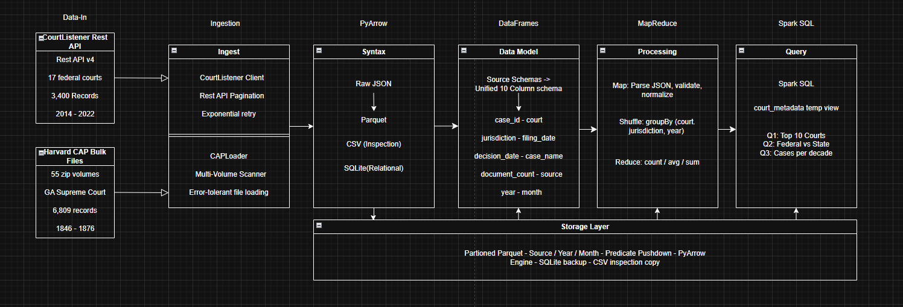

# Public Court Data Pipeline
**Author:** Josue Palacios | [github.com/josuepalacioss/Public-court-data-pipeline](https://github.com/josuepalacioss/Public-court-data-pipeline)

---

## Project Overview

**Domain:** Public court data analytics

A batch-oriented Big Data pipeline that ingests, normalizes, and analyzes public court metadata from two heterogeneous sources:

- **CourtListener REST API** - federal court opinions (SCOTUS, CA1, CA9), 2020–2024
- **Harvard Caselaw Access Project (CAP)** - Georgia state court bulk archives, 1808–2018

Both sources are normalized to a unified 10-column schema and persisted to partitioned Parquet, flat CSV, and SQLite, which enables analytics across different jurisdictions. By ingesting and analyzing the document metadata we can extract courts, dates, case types, document counts, and completeness indicators.This domain is motivated by the need for infrastructure to support legal research and analysis of judicial activity using large public datasets.


## Problem Statement

Since public court data exists on a large scale but is difficult to analyze efficiently due to the sheer
volume, heterogeneity, and different access constraints. Federal and state court datasets are
published by different organizations. The ones tackled here
include REST APIs provided by CourtListener and bulk archives provided by the Caselaw
Access Project by Harvard Law School.

_This project aims to address the following questions:_

- How does the volume of court cases and documents change over time across jurisdictions?
- How do federal and state court datasets differ in coverage and completeness?
- How complete are metadata fields across sources?

_At scale, these questions introduce several challenges:_

- Data volume by the hundreds of thousands to over a million records and the resulting space.
- Heterogeneous ingestion through combining incremental API based data with large bulk datasets.
- Schema variability that offers differing field structures and naming across sources.


## Scope

This project focuses on the design and implementation of a distributed, batch-oriented Big
Data pipeline for analyzing structured metadata derived from public court documents.

_In Scope_

Batch ingestion of heterogeneous public court datasets:

- Federal court metadata from the CourtListener REST API.
- State court metadata from the Harvard Caselaw Access Project (Georgia) bulk archives.

Schema normalization and validation to unify heterogeneous JSON sources into a shared
Parquet-based data model.

Metadata analytics:

- Case and document volume trends over time.
- Court and jurisdiction activity summaries.
- Completeness and coverage statistics for key metadata fields.

Distributed query execution using Spark SQL with partitioned Parquet datasets.
Local execution with a cloud-ready design that supports scaling via additional partitions
and executors.

_Out of Scope_

- Parsing, indexing, or analyzing the contents of court case PDF documents.
- Natural language processing, machine learning, or data mining.
- Legal interpretation or reasoning over court opinions.
- Real time or streaming data ingestion.


## Dataset Sources

- [CourtListener](https://www.courtlistener.com/help/api/) | Federal courts (SCOTUS, CA1, CA9), 2020-2024 | Free API token required
- [Harvard CAP](https://case.law/bulk/download/) | Georgia state courts, 1808–2018 | Free bulk download, no key needed


## Architecture




## Tech Stack

- **Python 3.11** - pipeline scripting and orchestration (PySpark requires ≤ 3.11)
- **PySpark 3.5.3** - distributed Spark SQL execution and MapReduce aggregations
- **Java JDK 17** - required PySpark runtime dependency
- **pandas 3.0.1** - DataFrame-based normalization and analytics
- **pyarrow 23.0.1** - Parquet read/write with partition and predicate pushdown support
- **requests 2.32.5** - CourtListener REST API client with pagination and retry logic
- **python-dotenv 1.2.2** - credential isolation via .env
- **PyYAML 6.0.3** - configuration management via settings.yaml


## Setup Instructions

### 1. Clone the repository

```bash
git clone https://github.com/josuepalacioss/Public-court-data-pipeline.git
cd Public-court-data-pipeline
```

### 2. Install dependencies

```bash
pip install -r requirements.txt
```

### 3. Configure credentials

```bash
cp config/.env.example .env
```

Edit `.env` and add your CourtListener API token:

```
COURTLISTENER_API_TOKEN=your_token_here
```

Get a free token by registering at [courtlistener.com/register](https://www.courtlistener.com/register/).

### 4. Download CAP bulk data (for state court records)

Download the Georgia Volume 1 zip and unzip it so the JSON files land at `data/raw/cap/json/`:

```bash
# Download from:
# https://static.case.law/ga/1.zip
# Then unzip:
unzip 1.zip -d data/raw/cap/
```

No API key is required for CAP bulk data.


## Usage

```bash
# Test API connection and check storage status
python main.py --mode test

# Ingest CourtListener federal court records only
python main.py --mode cl

# Ingest CAP Georgia bulk records only
python main.py --mode cap

# Run both sources end-to-end
python main.py --mode full

# Verify all stored data reads back correctly from Parquet
python main.py --mode verify
```

### Example output (--mode full)

```
--- CourtListener ingestion ---
  Raw JSON saved: data/raw/courtlistener/opinions_20260429_120000.jsonl (600 records)
  Schema valid: True
  Row count: 600
  Summary: {'total_records': 600, 'sources': {'courtlistener': 600}, 'jurisdictions': {'federal': 600}, ...}

--- CAP bulk ingestion ---
  Raw JSON saved: data/raw/cap/cap_georgia_20260429_120010.jsonl (93 records)
  Schema valid: True
  Row count: 93
  Summary: {'total_records': 93, 'sources': {'cap': 93}, 'jurisdictions': {'state': 93}, ...}
```


## Output Description

The pipeline produces three output formats in `data/processed/`:

- **Parquet** (`data/processed/parquet/court_metadata/`) - partitioned by `source/year/month`, primary analytical target with predicate pushdown support
- **CSV** (`data/processed/court_metadata_<timestamp>.csv`) - flat export for inspection and sharing
- **SQLite** (`data/processed/court_metadata.db`) - SQL-queryable database, table: `court_metadata`

### Unified Schema

Each record contains 10 normalized fields enforced across both sources:

- `case_id` *(string)* - unique identifier from source system
- `court` *(string)* - court name or slug
- `jurisdiction` *(string)* - `federal` or `state`
- `filing_date` *(string, ISO)* - date record was filed or created
- `decision_date` *(string, ISO)* - date of court decision, nullable
- `case_name` *(string)* - name of the case
- `document_count` *(int)* - number of opinions/documents in case
- `source` *(string)* - `courtlistener` or `cap`
- `year` *(int)* - extracted from filing_date, used as partition key
- `month` *(int)* - extracted from filing_date, used as partition key


## Repository Structure

```
.
├── README.md
├── LICENSE
├── requirements.txt
├── .env.example
├── .gitignore
├── config/
│   └── settings.yaml
├── src/
│   ├── ingestion/
│   │   ├── courtlistener_client.py
│   │   └── cap_loader.py
│   ├── processing/
│   │   └── normalizer.py
│   ├── storage/
│   │   └── db_handler.py
│   └── main.py
├── data/
│   ├── raw/         (gitignored)
│   ├── processed/   (gitignored)
│   └── sample/      (small fixture files for testing)
└── docs/
    ├── architecture.md
    ├── data_dictionary.md
    └── validation.md
```

## Project Status

**Complete:**
- CourtListener REST API ingestion (3,400 records, 17 courts, 2014–2022)
- CAP Georgia bulk ingestion (6,809 records, 55 volumes, 1846–1876)
- Schema normalization - unified 10-column schema across both sources
- Multi-format storage - partitioned Parquet, CSV, SQLite
- Data quality validation - schema checks, null rates, record counts
- Edge case handling - missing files, API errors, malformed records, rate limiting
- Verification mode - Parquet read-back confirms 10,209 rows persisted correctly

**Known Limitations:**
- CAP data is scoped to Georgia Supreme Court only; Harvard CAP has 6.7 million cases across all U.S. jurisdictions available at case.law/bulk/download/
- CourtListener ingestion is bounded by configured courts and date windows (confi


